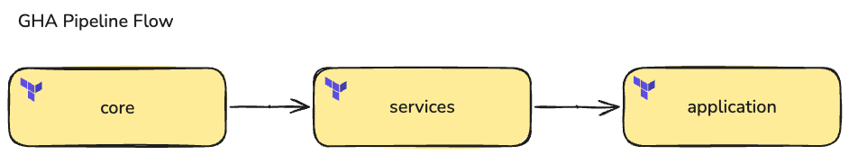
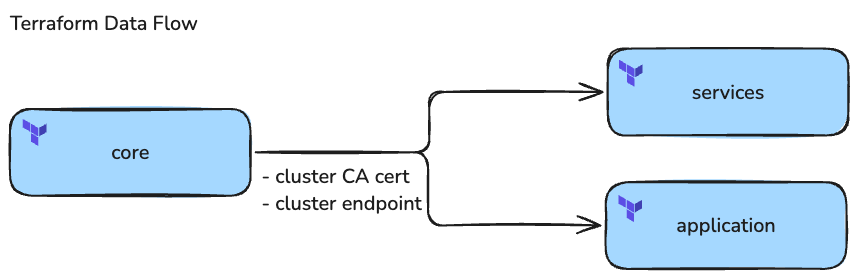
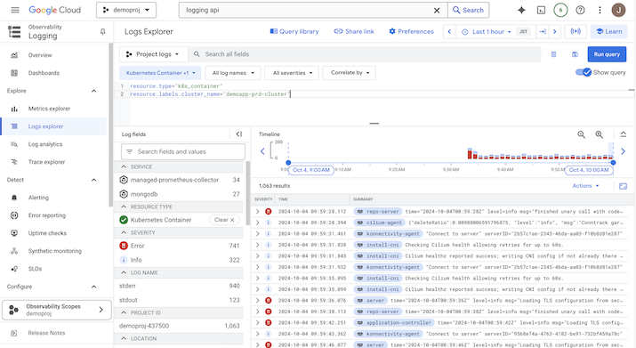
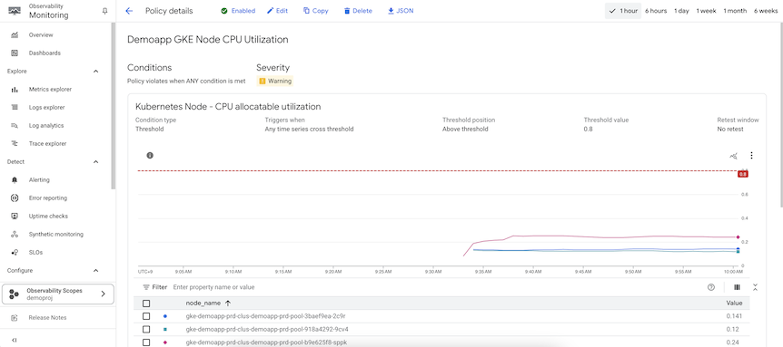

# k8s-demo-prod-infra

Terraform plan for deploying and configuring a GKE cluster, installing shared services, and deploying GCP infrastructure to support the production application ("demoapp").


## Features
- **Separation of Concerns** 
  - Limits "blast radius" by grouping infrastructure in a way that minimizes the number of infra components that must be "touched" when making changes
- **Reusability**
  - The terraform plans are parameterized in such a way that they can easily be used to deploy additional environments (e.g. nonprod)
- **Secure and Transparent**
  - Deployment is performed via a dedicated service account, access to which is tightly controlled via GCP IAM
  - Deployments are only performed using this service account via GHA, making all changes to infrastructure visible and auditable via git history
- **Observability and Alerting**
  - Basic logging has been configured at the cluster infra and k8s level (both for control plan and workloads)
  - A proof-of-concept alert has been configured via Terraform to alert when cluster node CPU utilization crosses a threshold

## Structure & Usage

### Repo Structure

```
.
├── core            GKE cluster and related GCP resources
├── services        Shared Kubernetes services
└── application     Production application GCP resources

```

Below is a description of what each plan does:

- **core**
  - Sets up basic Kubernetes infrastructure in GCP
  - Deploys the following:
    - GCP VPC and subnets
    - GKE cluster
    - GKE nodepool (defined separately for easier management)
    - GCP Service Account for cluster access (see [TODO](#todo) below)
- **services**
  - Sets up shared services on the k8s cluster
  - Deploys the following:
    - ArgoCD
    - Ingress Nginx controller
    - kube-prometheus stack, including Prometheus and Grafana (not used, just an example of where this sort of service would go)
    - Namespaces for the above applictions
    - DNS records pointing to the nginx ingresses for the above applications
- **application**
  - Sets up infrastructure to support the application.  
  - Deploys the following:
    - Namespace for "demoapp" application
    - DNS record pointing to the nginx ingress for the "demoapp" application


### Usage

The three plans described above are intended to be run in a specific order:

1. `core`
2. `services`
3. `application`

The GHA pipeline requires these plans to be run in this order (see Fig. 1 below).

The `core` plan statefile is referenced by a `terraform_remote_state` data source in both `services` and `application` in order to retrieve cluster information required for making changed to the cluster (see Fig. 2 below).  


Figure 1:  


Figure 2:  



### Monitoring and Alerting

GCP Logging has been enabled for the GKE cluster infrastructure and the Kubernetes cluster, including both the control plane and the workloads.  Logs can be viewed via the GCP console (see Fig. 3 below).  A simple alert has been configured as a "proof-of-concept" to notify when cluster node CPU utilization exceeds >80% (see Fig. 4 below).

Figure 3:  
[](./docs/gke_logging.png)


Figure 4:  
[](./docs/gke_alerting.png)


## Additional Context

### Assumptions
- Naming convention: Prod, QA, Dev are represented by the environment labels `prd`, `qal`, and `dev` respectively
- Existing infrastructure
  - State bucket `k8s-test-tfstate-c74f3a` 
  - Service account `gha-access` for programmatic access from GHA
  - Nginx Ingress TLS cert secrets manually created via certbot CLI
- GCP alert notification channel already exists

### TODO
  - General
    - Reconfigure networking so that internal services (e.g. Grafana) are only availabe on the private network
  - CI/CD
    - Configure GCP OIDC provider so that GHA does not have to store a GCP SA service key
    - Configure GHA pipeline to treat this repo as a monorepo using a cascading Terraform apply:
      - `core` modified:  `core -> services -> application`
      - `services` modified: `services -> application`
      - `application` modified: `application`
    - Configure GHA pipeline to allow Terraform to apply the `application` plan after changes are made to the application code repo
  - Core
    - Narrow `google_container_node_pool.node_config.oauth_scopes` in accordance with PoLP in prod; currently grants GCP SA access to all APIs
    - Parameterize GKE cluster config for horizontal/vertical cluster scaling
  - Services
    - Automate creation and renewal of TLS certs with certbot (using DNS01 challenge on GCP Cloud DNS)
    - Add additional IaC for ArgoCD configuration (project CRDs, etc.)
